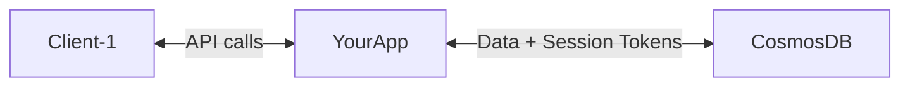
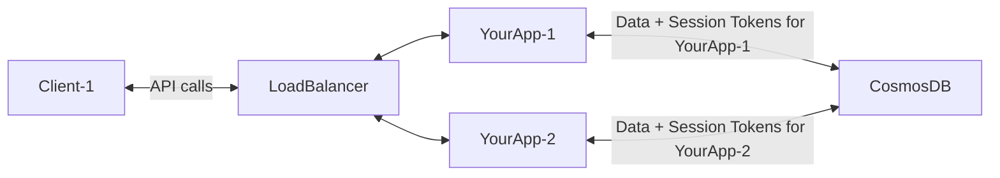
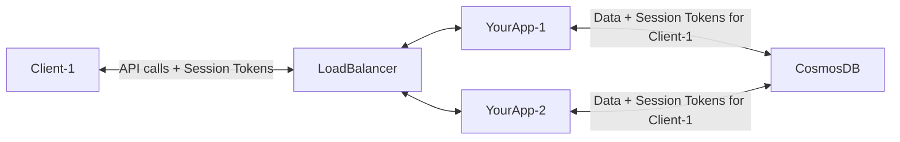

Cosmos DB Session Token Extensions for ASP.NET
=====
Gives users of your web app/API read-your-own-writes consistency by automatically associating Cosmos DB session tokens
with HTTP clients or sessions in ASP.NET.

## Who is this for?

If you:

* Are using Cosmos DB
* Are using ASP.NET to build a web app / web API
* Want to use Comsos DB [Session Consistency] to save money (vs. using
  a [stronger consistency level](https://learn.microsoft.com/en-us/azure/cosmos-db/consistency-levels#consistency-levels-and-throughput))
* Want users of your web app / API to have a good experience (e.g. by being able to immediately read their own writes,
  never see older results on a refresh, etc.)

then this might be a good fit for you.

If you use "sticky" request routing (guaranteeing that requests for a given client are routed to the same instance of
your application and the same instance of the Cosmos DB SDK each time), then you probably don't need this - the
automatic session token handling built into the SDK should work for you.

## What do these libraries do?

When using Cosmos DB [Session Consistency], Cosmos DB identifies a session using session tokens scoped to a given Cosmos
DB database (account?). On every write, Cosmos DB returns an updated session token for the write. If that session token
is passed to a subsequent read, Cosmos DB will treat that read as being in the same session, and
the [Session Consistency] guarantees apply for that write/read sequence.

For a single instance of the Cosmos DB .NET SDK client, the SDK will take care of session tokens for you automatically -
it will ensure that reads issued after writes automatically propagate the session token.

However, as an application scales horizontally (typically using a round-robin load balancer), and the separate
hosts/nodes/containers have their own SDK client instances, the SDK can no longer manage the session tokens alone since
subsequent requests from a single caller may be routed to different application instances each time:

In this environment, in order for subsequent requests from a given caller to be considered a single session, we
need [to track session tokens for each client, and use that client's latest session token with each subsequent request to Cosmos DB][UtilizeSessionTokens]:

These libraries make it really easy to do that with ASP.NET.

[Session Consistency]: https://learn.microsoft.com/en-us/azure/cosmos-db/consistency-levels#session-consistency
[UtilizeSessionTokens]: https://learn.microsoft.com/en-us/azure/cosmos-db/nosql/how-to-manage-consistency?tabs=portal%2Cdotnetv2%2Capi-async#utilize-session-tokens

## Projects

### CosmosDB.Extensions.SessionTokens.AspNetCore

Automatically propagates Cosmos DB session tokens to and from HTTP requests for you in ASP.NET Core.

This is done by sending the Cosmos DB session token to clients as cookies in HTTP responses. Cosmos DB session tokens included in
cookies on incoming HTTP requests are injected into Cosmos DB SDK calls for that HTTP request, and session tokens returned by Cosmos
DB in responses are set on the cookies in the response.

#### Requirements
* Target framework: `net6.0`
* ASP.NET Core

## Limitations

* If your application issues reads and writes to Cosmos DB parallel, some limitations apply:
    * **When your application issues multiple Cosmos DB writes in parallel, the session token returned for the session
      token returned for the most recently completed write wins**. As a result, read-your-own-writes consistency
      guarantees will apply only for the chain of writes whose session token completed last - other writes might not be
      reflected in future reads. The Cosmos DB API does not accept more than one session token on a given read request,
      so this cannot be mitigated. To guarantee read-your-own-writes semantics apply for all writes issued by your
      application in the context of a single HTTP request, do not issue the writes to Cosmos DB in parallel.
    * When your application issues a Cosmos DB read or query while processing an HTTP request, that read will use the
      session token returned for the most recently completed write (a write has 'completed' when an `await` on
      the `Task<T>` for that write call returns) issued in the context of that HTTP request. (This matches the behavior
      of the Cosmos DB .NET SDK).